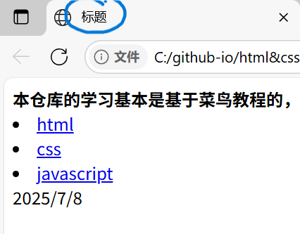

### 对于html我的学习想法是：note记录一些小技巧以及一些必要性的东西，更多的内容是直接用html写出来。  

贴一下菜鸟教程的html的链接如下  
> https://www.runoob.com/html/html-tutorial.html  

#### html：web页面  

对于构建自己的第一个html可以打开vscode，建立一个name.html文件，然后输入!，感叹号(英文)，tab，然后他就会自动补全了。  

补全后发现\<html\>里面有\<head\>以及<body>。  

head里面的title中间就是标题。  

  

对，就是图中圈起来的这个。  

而body里面写的内容就是我们要展示的界面内容了。  

**html后缀与htm后缀是一样的**  

**在vscode使用标签时候，如\<p\>，应该从左到右输入，这样输入完\"\>\"后，右半部分补全了。而不是以我的输入习惯，先输入括号，然后填充括号内的内容。**

#### html简介  

\<!DOCTYPE html\> 写在开头声明这是一个html文件。  
\<html\> 后边紧跟一个这个html标签。也属于固定化套路。**html标签有且仅有一个**  
\<head\>以及\<body\>是在html标签内的。head标签里面的meta标签声明了字符编码等元数据。meta:元。head标签里面的title标签是文件的标题。对于body里面就是web界面的html的正文了。  
对于body里面标签很多，如h1标签是一级标题，一些其他的标签在firstHtml里面说了。

**在浏览器按f12，在“元素”可以看html**  

html的标签通常是成对出现的，大概是：<标签>填充内容</标签>  

**<!DOCTYPE>声明有助于浏览器中正确显示网页**。  

#### 引入链接以及引入图片在linkAndImage里面说了  

对于html的标签最好是闭合，无论这个标签是成对出现还是单个的。  
> 

对于html的元素是可以嵌套的，即body元素里面写p标签（段落）p标签里面写strong（加黑加宽）  

对于我们之前使用的br换行，写作\ 。没有这个斜线也可以正常使用，当然加上这个斜线更规范些  

对于html标签大写小写都可以，不过我们**使用小写**  

属性是对于html元素的附加描述  

#### html的标题以及分隔符还有注释  
对于html的标题很简单，就是一开始的html说了，要注意的是，为了加黑字体使用strong而不是滥用标题即h1~h6标签。  
对于html的分割线可以使用“**hr标签**”  
对于html里面些注释**直接“\<!--这里直接写内容就好-->”,就注释掉了**  
对于markdown的注释也是这样写的  

#### 对于html的段落以及换行  
在html中，p标签用来定义一个新的段落，而br标签是用来同一个段落内的换行。  
> p标签是一对标签，不要忘记闭合标签  

**不难发现，html文件实际展示在浏览器的效果是忽略掉了多余的空格以及回车。。。在html文件中的直观排版是无效的**。  

#### 对于文本的格式化  
strong、b标签是粗体, em、i标签是斜体。  

#### 